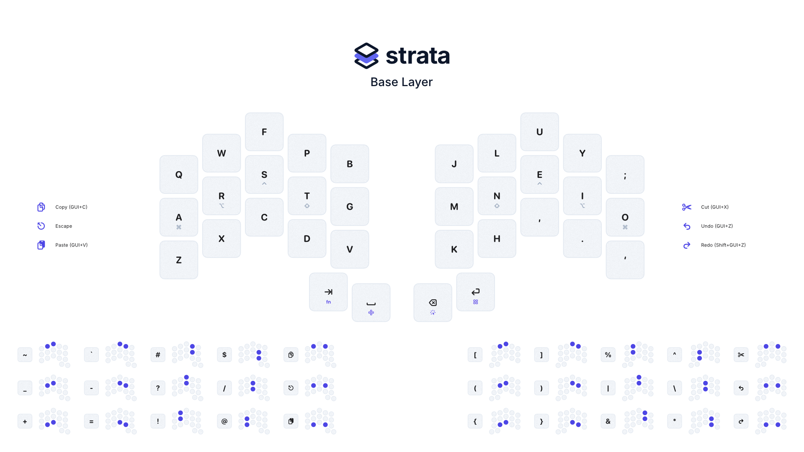
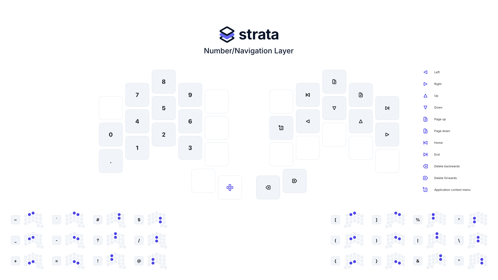
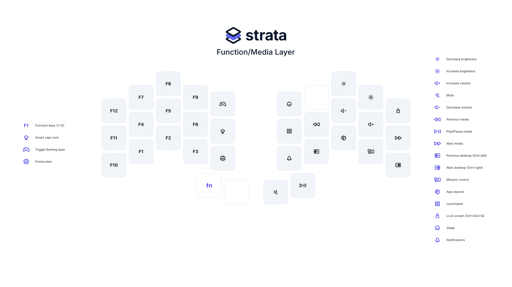
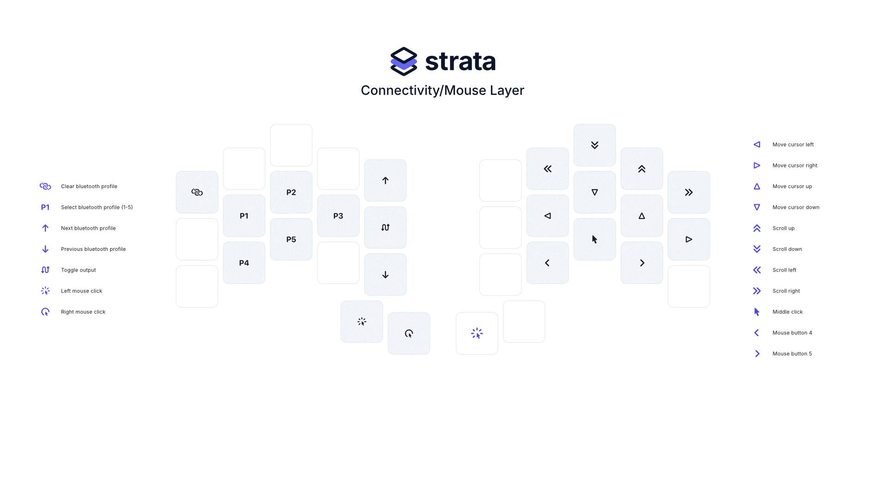
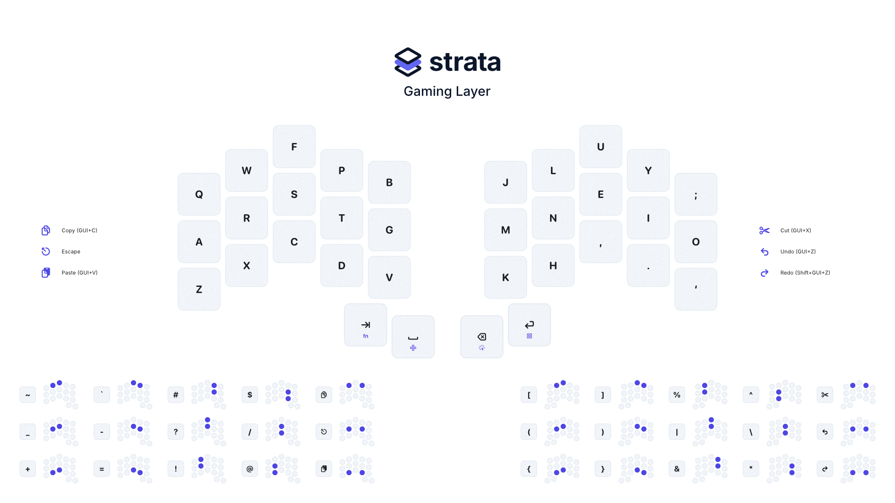
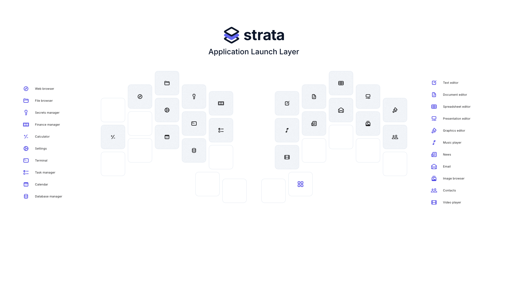

# Strata Reference

Strata is my personal 3x5+2 split keyboard keymap designed for the Ferris Sweep using [ZMK](zmk.dev).

## Features

- Utilise layers to organise keys.
- Maximise the usage of the thumb clusters.
- Stay on the home row as much as possible.
- Be simple and unobtrusive.

## Layers

### Base

The base layer includes the basic alphabet characters in Colemak-DH layout for general typing. It serves as the primary layer, accessed by default. It also includes the symbols and various useful punctionation charactors via combos.

### Navigation

The navigation layer offers keys for cursor movement, including arrow keys, Home, End, Page Up, and Page Down. The numbers portion of this layer provides direct access to number keys and some frequently used mathematical symbols.

### Functions

The functions layer features function keys (F1-F12) and other utility keys, such as Print Screen and Caps Word. The media portion of this layer provides controls for media playback, volume adjustment, and other multimedia functions. It is designed for managing audio and video content.

### Mouse

The mouse layer includes keys which can be used for moving the cursor, scrolling, and clicking. The connectivity portion of this layer includes keys for toggling Bluetooth, connecting to different devices, and other wireless functions. This layer facilitates easy switching and management of connections.

### Gaming

The gaming layer is nearly identical to the base layer; however, all home row mods are removed to allow for held key mechanics (e.g., WASD-like movement, etc.) and the copy/paste combinations are removed.

### Launch

The Application Launch Layer provides quick access to launch many useful applications. Keycodes are Consumer keycodes, requires support from OS and potentially some extra configuration to work successfully.

